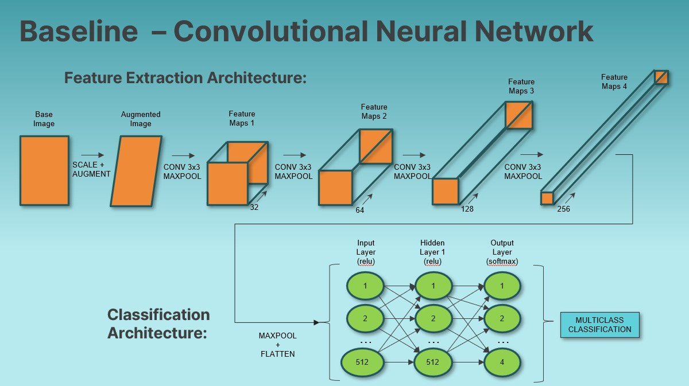
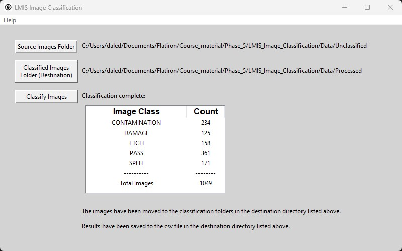
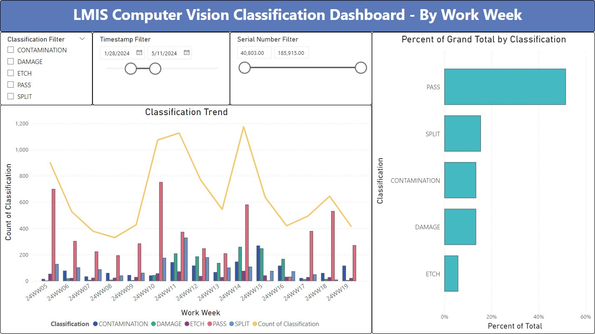

# Computer Vision for Thermo Fisher Scientific Manufacturing
## Analysis Overview
This project analyzes over 7k production quality images from Thermo Fisher Scientic (TFS). We will perform Exporatory Data Analysys (EDA) to assess the data, and create machine learning models to predict the outcome of the quality classification of the images.

## Business Problem
[TFS in Hillsboro, Oregon](https://www.thermofisher.com/us/en/home/electron-microscopy/nanoports/hillsboro-nanoport.html) manufactures Scanning Electron Microscopes (SEM).  In production, Liquid Metal Ion Source (LMIS) units are imaged at a SEM and human inspected for quality issues.  This process is costly and can be problematic due to varying human biases. Our goal is to create an automated Computer Vision process that will accurately classify LMIS SEM images, thus reducing labor cost and quality problems incurred due to varying human inspection biases.


## Data
LMIS SEM images were downloaded from TFS under Non-Disclosure Agreement (NDA):
- 7,019 grayscale SEM image files
- Images pre-labeled and sorted into 5 class folders
- Due to the NDA: 
   - Source image data is not available to the reader. 
   - Details containing intellectual property are intentionally omitted.


## Methods
Exploratory Data Analysis (EDA):
- Each image in the data set was reviewed for classification error, and moved to the correct classification folder if necessary.
   - Collaborated with a subject matter expert at TFS for classification instructions
   - Noted that some images contain features of multiple non-PASS classification.  In these cases, the most dominent feature was chosen for the classification.
- Class imbalance was noted during EDA to guide modeling methods later on.

Data Preparation:
- Image files were randomly moved into Training(70%), Validation(15%), and Test(15%) folders, with each classification represented within subfolders for each set.

Modeling:
- Convolutional Neural Network (CNN) was chosen as the modeling architecture due to known high performance for Computer Vision tasks.
- A Baseline multi-classification model was established and iterated upon with strategic adjustments to hyperparameters.
- Each model was trained and validated with the respective data sets during each epoch.
- After training, each model was tested with the holdout test set and evaluated for accuracy metrics.
- Due to the high compute cost of training, Google Colab was used to train the models.
- The final CNN architecture and hyperparameters were selected based on the highest multi-classification accuracy.
- The final CNN had the probability threshold for the PASS class adjusted to limit false positive rate so as not to exceed 2% (for quality purposes, we do not want to ship failing units)

Implementation:
- Because the manufacturing production area is behind a firewall and cannot access online modeling tools such as Flask or Streamlit, an executable program was created in python for the purpose of running on production images.
- An interactive PowerBI dashboard was developed and provided for the purpose of monitoring production performance of the executable classifier, which logs its ongoing results to a csv.

## Results
Baseline (Model 0) multiclass CNN architecture is shown below. (Note, the fifth class, Etch, was not added until iteration 21 see below):



This may make the project unrealistically easy; a worthy future project would be to remove all such jargon from the training to provide a more realistic model.

Here is the model iterations accuracy trend, with some highlights and lowlights called out:


Below is the Correlation Heatmap of the final engineered features chosen, each of which were normalized by the length of the email to make them ratios. Then the predicted probabilities from the subject line model were added, which had an 80% correlation to the target, to boost the Email Body model performance:


Here is a snapshot of the classification executable, which moves unclassified images to classification folders and logs results to a csv logfile:


Here is a snapshot of the Power BI interactive production dashboard that pulls from the csv logfile (fictitious data shown, not real TFS production data):



## Conclusions
Best Model: Deep (5 Layers) Neural Network Hyperband Tuned
- Best Scores:
    - Recall = 94.6%
    - F1 = 96.0%
    - AUC = 96.8%	
    - Train Accuracy = 99.4%
    - Accuracy = 97.7%
    - Precision = 97.5%
    - FPR (HAM going to SPAM) = 0.9%
    - FNR (SPAM going to HAM) = 6%
- Parameters:
    - 'dropout1': 0.5
    - 'activation': 'relu' 
    - 'layer_1': 896 nodes
    - 'dropout2': 0.5
    - 'layer_2': 64 nodes
    - 'layer_3': 256 nodes
    - 'layer_4': 256 nodes
    - 'layer_5': 128 nodes
    - 'learning_rate': 0.0001
    - 'batch_size': 32


## Recommendations
1. Implement the best Neural Network model during initial Email service rollout
2. Continue to retrain and retune the models on new anonymized customer data
3. Investigate other potential model improvements (see next steps)

## Next Steps
1. Continue to improve the model:
   - Rerun and tune the models with the ‘Jargon words’ removed
   - Investigate tokenizing based on wordcloud algorithm
   - Check other model architectures (RandomForest, XGBoost)
   - Tune NN for subject-line only, perhaps effective and more efficient
   - Investigate verbiage and nature of SPAM, are there features we can capture
   - Investigate the False cases; are there features we can capture
   - Investigate keeping URLs instead of scrubbing them preprocess
2. Acquire larger data sets of up-to-date emails


## For More Information
To see the full data analysis check out the [Jupyter Notebook](./Spam_Filter_Notebook.ipynb) or review the [presentation](./Spam_Filter_Presentation.pdf).

For any additional questions please contact Dale DeFord at:
- daledeford@gmail.com
- https://www.linkedin.com/in/dale-deford-81b54092/

## Repository Structure
```
├── images
├── src
├── README.md
├── Spam_Filter_Presentation.pdf
└── Spam_Filter_Notebook.ipynb
```