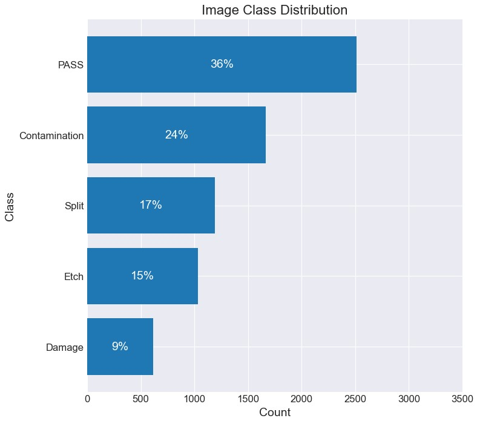
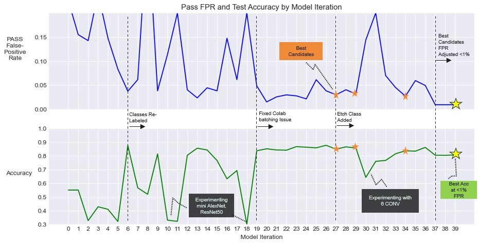
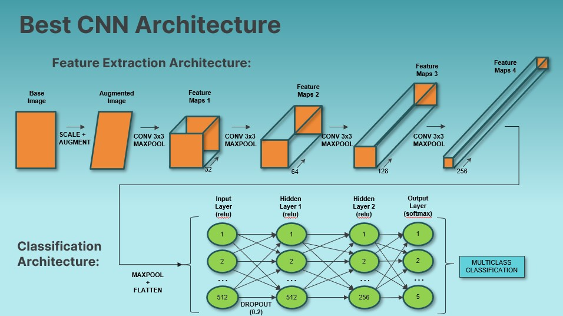
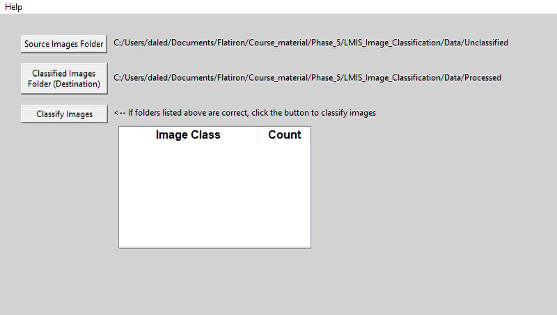
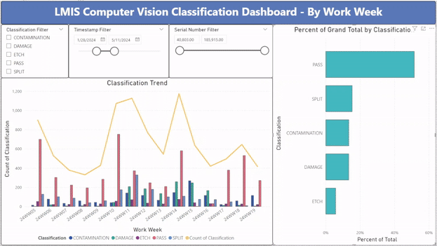

# Computer Vision Quality Inspection for Thermo Fisher Scientific
## Analysis Overview
This project analyzes over 7k production quality images from Thermo Fisher Scientic (TFS). We will perform Exporatory Data Analysys (EDA) to assess the data, and create machine learning models to predict the outcome of the quality classification of the images.

## Business Problem
[TFS in Hillsboro, Oregon](https://www.thermofisher.com/us/en/home/electron-microscopy/nanoports/hillsboro-nanoport.html) manufactures Scanning Electron Microscopes (SEM).  In production, Liquid Metal Ion Source (LMIS) units are imaged at a SEM and human inspected for quality issues.  This process is costly and can be problematic due to varying human biases. Our goal is to create an automated Computer Vision process that will accurately classify LMIS SEM images, thus reducing labor cost and quality problems incurred due to varying human inspection biases.


## Data
LMIS SEM images were downloaded from TFS under Non-Disclosure Agreement (NDA):
- 7,019 grayscale SEM image files
- Images pre-labeled and sorted into 5 class folders
- Due to the NDA: 
   - Source image data is not available to the reader. 
   - Details containing intellectual property are intentionally omitted.


## Methods
Exploratory Data Analysis (EDA):
- Each image in the data set was reviewed for classification error, and moved to the correct classification folder if necessary.
   - Collaborated with a subject matter expert at TFS for classification instructions
   - Noted that some images contain features of multiple non-PASS classification.  In these cases, the most dominent feature was chosen for the classification.
- Class imbalance was noted during EDA as shown below.

Data Preparation:
- Image files were randomly moved into Training(70%), Validation(15%), and Test(15%) folders, with each classification represented within subfolders for each set.
- Data augmentation was used on the images during model training to improve sample variance and avoid overfitting

Modeling:
- Convolutional Neural Network (CNN) was chosen as the modeling architecture due to known high performance for Computer Vision applications.
- A Baseline multi-classification model was established and iterated upon with strategic adjustments to hyperparameters.
- Each model was trained and validated with the respective data sets during each epoch.
- After training, each model was tested with the holdout test set and evaluated for accuracy metrics.
- Due to the high compute cost of training, Google Colab was used to train the models.
- The final CNN architecture and hyperparameters were selected based on the highest multi-classification accuracy along with lowest false-positive rate within the PASS class.
- The final CNN had the probability threshold for the PASS class adjusted to limit false positive rate so as not to exceed 1% (for quality purposes, we do not want to ship failing units)

Implementation:
- Because the manufacturing production network is behind a firewall and cannot access online modeling tools such as Flask or Streamlit, an executable program was created in python for the purpose of classifying production images.
- An interactive PowerBI dashboard was developed and provided for the purpose of monitoring production performance of the executable classifier, which logs its ongoing results to a csv.

## Results
Class weights were imposed during model training to account for class imbalance shown below:


Here is the model iterations accuracy trend, with some highlights and lowlights called out:


Best performing CNN architecture is shown below:


Here is a gif demonstrating operation of the classification executable, which moves unclassified images to classification folders and logs results to a csv logfile:


Here is a gif demonstrating the Power BI interactive production dashboard that pulls from the csv logfile (fictitious data shown, not real TFS production data):



## Conclusions
Best Model: Deep (5 Layers) Neural Network Hyperband Tuned
- Best Scores:
...
- Parameters:
...


## Recommendations
1. Initiate a production pilot of provided LMIS Image Classification executable and assess its performance vs. human inspection
   - Recommended pilot evaluation plan:
      - Human review every image for 1 month.  After 1 month:
         - If PASS class false-positive rate <1%, discontinue human evaluation of PASS class images as process of record.
         - Continue long-term human review of all non-PASS images as process of record until model can be improved.
2. Monitor script classification results via provided Power BI dashboard
3. Continue to improve the models with more data as outlined below


## Next Steps
1. Continue to improve the model:
   - Need more data!
      - Subject matter expert labeling of many more images
      - Train with ‘clean’ samples, i.e., no images that could be more than 1 class
   - Continue attempting transfer learning architectures, i.e., ResNet50
2. If adequate model accuracy can be achieved, implement another production pilot to eliminate human inspection of all images


## For More Information
To see the full data analysis check out the [Jupyter Notebook](./Spam_Filter_Notebook.ipynb) or review the [presentation](./Spam_Filter_Presentation.pdf).

For any additional questions please contact Dale DeFord at:
- daledeford@gmail.com
- https://www.linkedin.com/in/dale-deford-81b54092/

## Repository Structure
```
├── images
├── README.md
├── LMIS_Classification_Presentation.pdf
└── LMIS_Classification_Notebook.ipynb
```